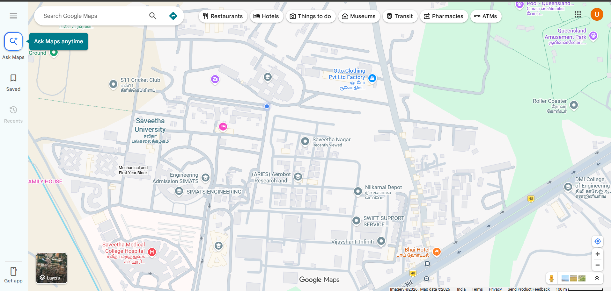
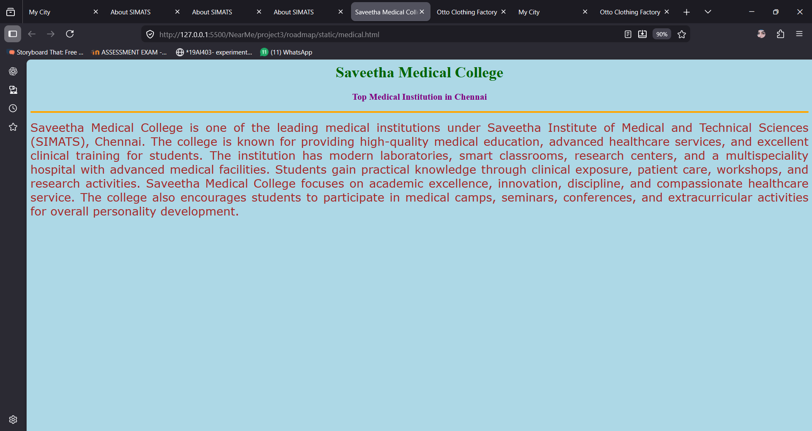
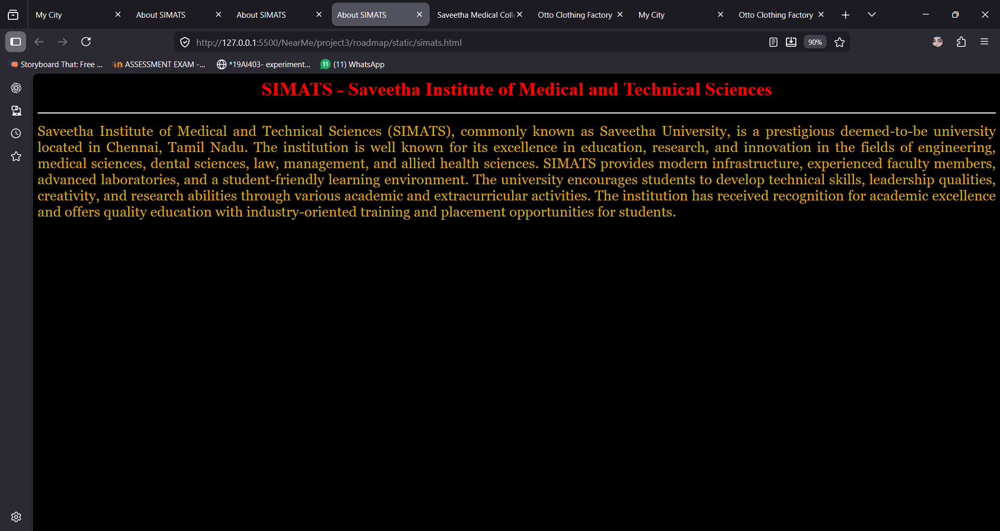

# Ex03 Places Around Me
## Date: 21-05-2026

## AIM
To develop a website to display details about the places around my house.

## DESIGN STEPS

### STEP 1
Create a Django admin interface.

### STEP 2
Download your city map from Google.

### STEP 3
Using ```<map>``` tag name the map.

### STEP 4
Create clickable regions in the image using ```<area>``` tag.

### STEP 5
Write HTML programs for all the regions identified.

### STEP 6
Execute the programs and publish them.

## CODE
```
<html>
<head>
<title>My City</title>
</head>

<body>

<h1 align="center">
<font color="red"><b>saveetha nagar</b></font>
</h1>

<h3 align="center">
<font color="blue">
<b>UDHAYA.S(25013347/212225230287)</b>
</font>
</h3>

<center>



<map name="MyCity">

<area shape="circle" coords="100,100,800,800" href="simats.html" title="SIMATS ENGG CLG">
<area shape="circle" coords="640,200,30" href="medical.html" title="Saveetha Medical">
<area shape="circle" coords="1120,360,25" href="otto.html" title="Otto factory">
</map>

</center>

</body>
</html>
```
```
<html>
<head>
<title>Otto Clothing Factory</title>
</head>

<body bgcolor="lavender">

<h1 align="center">
<font color="darkblue">
<b>Otto Clothing Factory</b>
</font>
</h1>

<h3 align="center">
<font color="maroon">
<b>Leading Garment Manufacturing Industry</b>
</font>
</h3>

<hr size="4" color="green">

<p align="justify">

<font face="Tahoma" size="5" color="black">

Otto Clothing Factory is one of the well-known garment manufacturing companies 
specialized in producing high-quality textile and fashion products. The factory 
is recognized for its modern production techniques, skilled workers, and commitment 
to quality standards in the textile industry.

The company manufactures various clothing products including T-shirts, uniforms, 
casual wear, and export garments. Advanced machinery and innovative technologies 
are used in the production process to ensure efficiency and durability.

Otto Clothing Factory also provides employment opportunities to many workers and 
contributes significantly to the growth of the textile and apparel industry. 
The factory focuses on customer satisfaction, timely delivery, and maintaining 
international quality standards.

</font>

</p>

</body>
</html>
```
```
<html>
<head>
<title>Saveetha Medical College</title>
</head>

<body bgcolor="lightblue">

<h1 align="center">
<font color="darkgreen">
<b>Saveetha Medical College</b>
</font>
</h1>

<h3 align="center">
<font color="purple">
<b>Top Medical Institution in Chennai</b>
</font>
</h3>

<hr size="4" color="orange">

<p align="justify">

<font face="Verdana" size="5" color="brown">

Saveetha Medical College is one of the leading medical institutions under 
Saveetha Institute of Medical and Technical Sciences (SIMATS), Chennai. 
The college is known for providing high-quality medical education, advanced 
healthcare services, and excellent clinical training for students.

The institution has modern laboratories, smart classrooms, research centers, 
and a multispeciality hospital with advanced medical facilities. Students gain 
practical knowledge through clinical exposure, patient care, workshops, and 
research activities.

Saveetha Medical College focuses on academic excellence, innovation, discipline, 
and compassionate healthcare service. The college also encourages students to 
participate in medical camps, seminars, conferences, and extracurricular activities 
for overall personality development.

</font>

</p>

</body>
</html>
```
```
<html>
<head>
<title>About SIMATS</title>
</head>

<body bgcolor="black" text="goldenrod">

<h1 align="center">
<font color="red">
<b>SIMATS - Saveetha Institute of Medical and Technical Sciences</b>
</font>
</h1>

<hr size="3" color="white">

<p align="justify">

<font face="Georgia" size="5">

Saveetha Institute of Medical and Technical Sciences (SIMATS), commonly known as 
Saveetha University, is a prestigious deemed-to-be university located in Chennai, 
Tamil Nadu. The institution is well known for its excellence in education, research, 
and innovation in the fields of engineering, medical sciences, dental sciences, law, 
management, and allied health sciences.

SIMATS provides modern infrastructure, experienced faculty members, advanced laboratories, 
and a student-friendly learning environment. The university encourages students to develop 
technical skills, leadership qualities, creativity, and research abilities through various 
academic and extracurricular activities.

The institution has received recognition for academic excellence and offers quality education 
with industry-oriented training and placement opportunities for students.

</font>

</p>

</body>
</html>
```


## OUTPUT






## RESULT
The program for implementing image maps using HTML is executed successfully.
